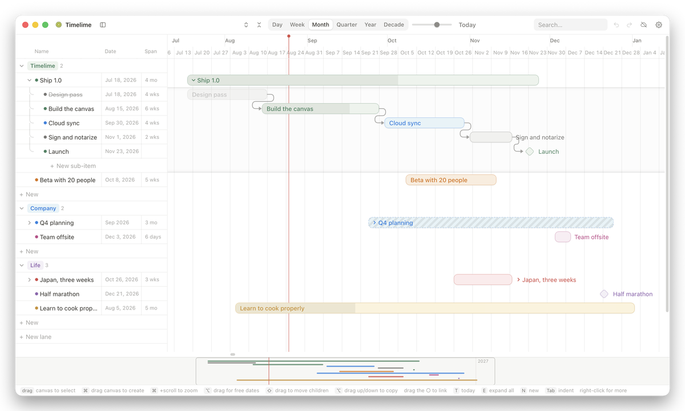

# Timelime

Plan projects and a whole life on one canvas. A Mac app, built because Notion's
timeline view is close but not quite right.

**[Download the latest release](https://github.com/jpnortonwastaken/Timelime/releases/latest)** —
universal for Apple Silicon and Intel, signed and notarized, so it opens without
a warning. macOS 11 or later.



## What it does

- Blocks on a timeline, nested as deeply as you like and grouped into lanes
- Dependencies between blocks, with dependents shifting when a date moves
- Continuous zoom from a single day out to a 110-year life view
- **Fuzzy dates** — every date carries a precision, so "sometime in 2031" renders
  hatched and uncertain rather than looking as scheduled as "Nov 3–7"
- Drag to move, ⌥-drag up or down to copy, ⌥-drag sideways for exact dates
- A properties table that is a real resizable pane, not a toggle that resets

## Your data

The plan lives on your Mac and works with no account and no network. Sign in
with Google and it follows you to every Mac you use — merged **per block**, so
two machines editing different things never overwrite each other, and a delete
on one does not come back from the other.

No analytics, no tracking, no advertising. You can delete your account and
everything stored against it from inside the app, and export the whole plan as
JSON at any time.

[Privacy policy](https://jpnortonwastaken.github.io/Timelime/privacy.html) ·
[Terms](https://jpnortonwastaken.github.io/Timelime/terms.html) ·
[Website](https://jpnortonwastaken.github.io/Timelime/)

## Running it

```bash
cd app
npm install
npm run dev        # in a browser
npm run tauri dev  # the Mac app
npm test           # the sync merge, which is the part worth testing
```

`npm run release` builds, signs, notarizes and staples a universal `.dmg`, plus
the artifacts an installed copy needs to update itself. It needs a Developer ID
certificate and a `timelime` notarytool keychain profile; it says so and stops if
either is missing.

## Stack

React + TypeScript + Vite, wrapped in Tauri. Firebase Auth and Firestore for the
optional sync. About 14 MB installed.

## Docs

- [`app/README.md`](app/README.md) — architecture, the non-obvious bits, the full
  keyboard map, and a running list of things that were harder than they looked
- [`PLAN.md`](PLAN.md) — the original design doc
- [`docs/demo/timelime-demo.json`](docs/demo/timelime-demo.json) — the plan in the
  screenshot above, importable with ⇧⌘I to retake it
